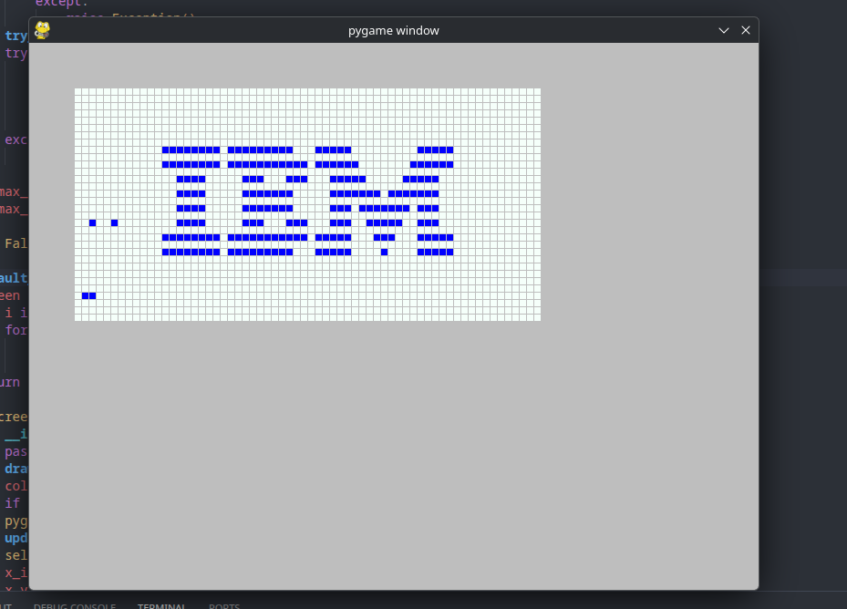

## CHIP-8 Emulator

### What is this?

This is an emulator for the CHIP-8. Technically speaking, it's not a true emulator since it does not emulate physical hardware. So it's actually closer to an interpreter.

### What can it do?

Only one program! It can the run the 'IBM Logo' program which displays the IBM logo.

Exciting, isn't it?

### What's missing?

So far I've implemented 6 out of 35 instructions. And I am still not 100 % on the drawing function.

### How do I run this?

1. Install the latest version of python and git
2. Open your favourite Linux terminal and clone this repository via: ``git clone git@github.com:tubbeg/chip_8_emulator.git``
3. Run ``cd chip_8_emulator``
4. Run ``python -m pip install requirements.txt``
5. Run ``python emulator.py my/path/to/chip8/file.ch8``
6. Enjoy!